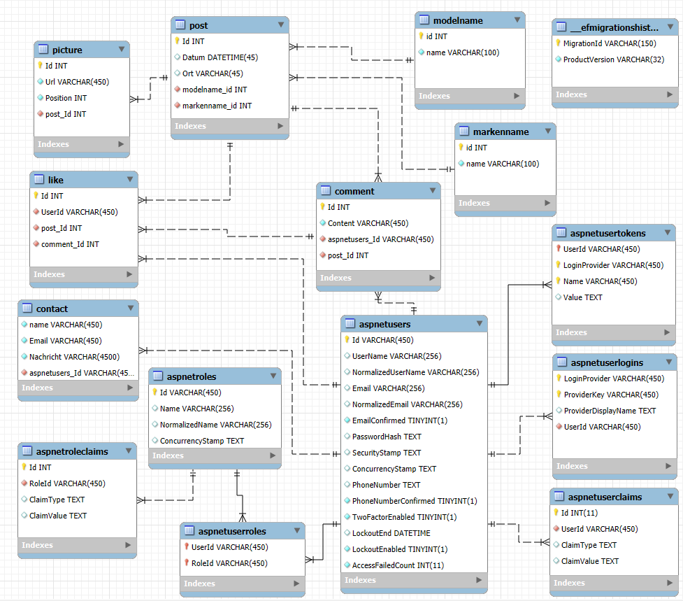
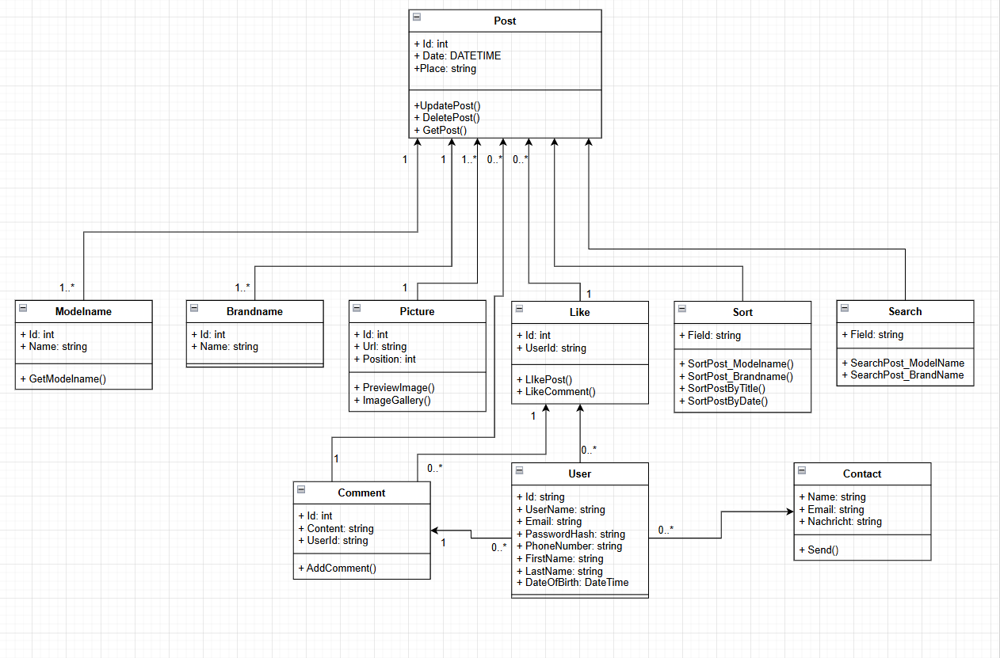

# Carsdex
## Inhaltsverzeichnis
- Warum Carsdex
- Projektbeschreibung
  - Posts erstellen
  - Posts anzeigen
  - Posts sortieren
  - Account erstellen
  - Posts liken und kommentieren
  - Kontaktformular ausfüllen
- Projektzustand
  - Was gemacht ist
  - Was noch gemacht werden muss
- Diagramme
  - ERD (Datenbankschema)
  - UML (Klassendiagramm)
- Glossar
- Quellen

## Warum Carsdex
Carsdex wird entwickelt, um meine Autofotos besser zu ordnen. Ich fotografiere gerne Autos. Diese Bilder sind momentan auf einem USB-Stick gespeichert, und es dauert oft lange, bis ich ein bestimmtes Auto, das ich einmal fotografiert habe, wiederfinde. Auf Carsdex können ich und andere interessierte Nutzer alle meine aufgenommenen Bilder ansehen. Ausserdem kann man nach Marken- und Modellnamen suchen und filtern. Zusätzlich sieht man, wann und wo die Fotos aufgenommen wurden.

## Projektbeschreibung
Das Projekt ist eine Blazor-Webseite, auf der ich verschiedene Fotos von Autos posten kann. So können ich und andere User die Fotos nach verschiedenen Kriterien suchen und filtern. Dadurch lassen sich die Fotos schneller finden und anschauen. (Hier sind die [Desgins](../Planung/Design/mockups_figma.md))

### Posts erstellen
Man kann verschiedene Posts von Autos erstellen und diese veröffentlichen. Dafür geht man auf der Hauptseite auf das Plus-Symbol unten links. Auf der Seite zum Erstellen eines Posts kann man eines von fünf verschiedenen Layouts auswählen und die Bilder in beliebiger Reihenfolge hinzufügen. Danach gibt man den Modell- und Markennamen, den Ort und das Datum an. Optional kann man weitere Bilder hinzufügen, die nicht direkt im Post sichtbar sind, sondern erst angezeigt werden, wenn man auf ein Bild klickt und die Bildergalerie öffnet.

### Posts anzeigen
Alle Posts werden auf der Hauptseite angezeigt, wobei der neuste Post zuoberst steht. Wenn man sich die Bilder genauer anschauen möchte, kann man direkt auf ein Bild klicken. Danach werden alle Bilder in einer Galerie angezeigt. Links werden ausserdem alle Modellnamen der nächsten Posts angezeigt, und rechts sieht man die Likes und Kommentare.

### Posts sortieren
Man kann Posts suchen und nach bestimmten Kriterien filtern. Die Posts können nach Marken- und Modellnamen gefiltert werden, sodass nur die gesuchten Posts angezeigt werden.

### Account funktionen
Wenn man möchte, kann man einen Account erstellen. Mit diesem Account kann man alle Posts kommentieren und liken. Ausserdem ist es möglich, Kommentare zu liken. Zusätzlich kann man über das Kontaktformular Fragen stellen und Feedback geben.

## Projektzustand
Das Projekt ist momentan in einem nicht fertigen Zustand, es müssen noch einige Funktionen implementiert werden damit das Produkt fertig ist und in verwendung gebracht werden kann.

### Was gemacht ist

### Was noch gemacht werden muss
- [Post](https://github.com/davidP1278/Carsdex/issues/50)
  - [Post posten](https://github.com/davidP1278/Carsdex/issues/51)
    - [POST methode](https://github.com/davidP1278/Carsdex/issues/15)
    - [Daten des Posts in Datenbank speichern](https://github.com/davidP1278/Carsdex/issues/52)
    - [Bilder speichern und URL in Datenbank speichern](https://github.com/davidP1278/Carsdex/issues/53)
  - [Daten in Post eintragen](https://github.com/davidP1278/Carsdex/issues/54)
    - [Design der Post Seite](https://github.com/davidP1278/Carsdex/issues/57)
  - [Post bearbeiten](https://github.com/davidP1278/Carsdex/issues/58)
    - [UPDATE Methode](https://github.com/davidP1278/Carsdex/issues/59)
  - [Post löschen](https://github.com/davidP1278/Carsdex/issues/60)
    - [DELETE Methode](https://github.com/davidP1278/Carsdex/issues/61)
  - [Post anzeigen](https://github.com/davidP1278/Carsdex/issues/62)
    - [GET Methode für Post](https://github.com/davidP1278/Carsdex/issues/16)
    - [Von Neu -> Alt sortieren (Ohne Filter)](https://github.com/davidP1278/Carsdex/issues/63)
    - [Infinity scroll auf der Hauptseite](https://github.com/davidP1278/Carsdex/issues/23)
    - [Post liken und kommentieren](https://github.com/davidP1278/Carsdex/issues/24)
      - [Like und Kommentare Datenbank](https://github.com/davidP1278/Carsdex/issues/65)
    - [Bildergalerie](https://github.com/davidP1278/Carsdex/issues/22)
    - [Design der Hauptseite](https://github.com/davidP1278/Carsdex/issues/66)
      - [Mobile Design](https://github.com/davidP1278/Carsdex/issues/67)
    - [Posts Suchen/Filter](https://github.com/davidP1278/Carsdex/issues/68)
      - [Such funktion nach Markenname (fuzzy search)](https://github.com/davidP1278/Carsdex/issues/19)
      - [Modelname suchen/sortieren (fuzzy search)](https://github.com/davidP1278/Carsdex/issues/69)
      - [Posts von a -> z sortieren (mit Filter)](https://github.com/davidP1278/Carsdex/issues/70)
  - [Sidebar auf der Mainpage](https://github.com/davidP1278/Carsdex/issues/71)
    - [GET Methode für Modelnamen](https://github.com/davidP1278/Carsdex/issues/73)
    - [Burger Menu im Mobile Desgin](https://github.com/davidP1278/Carsdex/issues/74)
- [Login & Rollen](https://github.com/davidP1278/Carsdex/issues/43)
  - [Admin Rolle](https://github.com/davidP1278/Carsdex/issues/25)
    - [Berechtigungen der Admin Rolle](https://github.com/davidP1278/Carsdex/issues/45)
  - [Normaler User Rolle](https://github.com/davidP1278/Carsdex/issues/26)
  - [Button für die Login Seite](https://github.com/davidP1278/Carsdex/issues/44)
    - [Login Seite](https://github.com/davidP1278/Carsdex/issues/46)
      - [Die erfassten User in die Datenbank speichern](https://github.com/davidP1278/Carsdex/issues/49)
- [Kontakt Seite](https://github.com/davidP1278/Carsdex/issues/75)
  - [Kontakt Feld designen](https://github.com/davidP1278/Carsdex/issues/32)
    - [Mobile Design für das Kontaktfeld](https://github.com/davidP1278/Carsdex/issues/76)
  - [Funktion zum absenden des Kontaktformulars](https://github.com/davidP1278/Carsdex/issues/77)

## Diagramme
### ERD (Datenbankschema)

### UML (Klassendiagramm)

## Glossar
| Begriff           | Bedeutung                                                                                                            |
| ----------------- | -------------------------------------------------------------------------------------------------------------------- |
| Post              | Ein Beitrag der Daten zum Auto enthält und die dazu gehörigen Bilder.                                                |
| posten            | Einen Post veröffentlichen, damit er für alle sichtbar ist.                                                          |
| Admin             | Ein Benutzer der rechte zum posten hat.                                                                              |
| Anonymer Benutzer | Ein Benutzer der nicht Regestriert ist.                                                                              |
| Markenname        | Der Markenname eines Autos (Bsp. Porsche)                                                                            |
| Modellname        | Der Modellname eines Autos (Bsp. 911 GT 3RS)                                                                         |
| Bildergalerie     | Eine Funktion, um Bilder eines Fahrzeugs in grösserer Darstellung anzuschauen.                                       |
| Startseite        | Die erste Seite, die beim Öffnen der Webseite angezeigt wird. Sie zeigt alle Beiträge an, sortiert von neu nach alt. |

## Quellen
Telerik, 08.01.2026, ImagePreview: https://www.telerik.com/blazor-ui/documentation/knowledge-base/upload-preview-image

Stackoverflow, 08.01.2026, RenderFragment: https://stackoverflow.com/questions/75757982/referencing-a-blazor-component-renderfragment-inline-rather-than-as-nested-child
