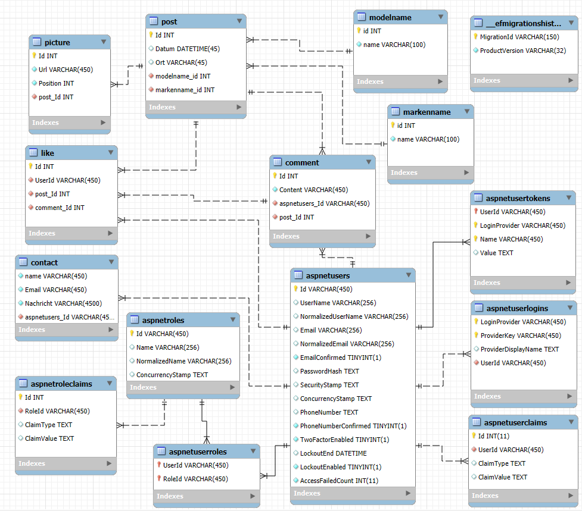

# Carsdex
## Inhaltsverzeichnis
- Projektbeschreibung
  - Wieso?
  - Nutzen
- Diagramme
  - ERD (Datenbankschema)
- Glossar
- Quellen

## Projektbeschreibung
Dieses Projekt ist eine Webseite, auf der ich meine selbstgemachten Autofotos hochladen und mit Informationen wie **Marke, Modell, Ort und Datum** versehen kann.  
Die User der Seite können sich die Beiträge auf der Startseite ansehen, gezielt nach bestimmten Autos suchen oder nach Automarken sortieren.

### Wieso  
Da ich meine Autofotos nicht einfach nur unsortiert auf meinem PC liegen lassen wollte, habe ich nach einer Möglichkeit gesucht, sie übersichtlich zu ordnen und zu präsentieren.

So entstand die Idee, eine eigene Webseite zu erstellen. Dort kann ich meine Bilder nicht nur nach **Marke, Modell, Ort und Datum** sortieren, sondern sie auch anderen Personen zeigen, die sich für Autos interessieren.

### Nutzen
- Ich habe eine **strukturierte Sammlung** meiner Autofotos.
- Besucher können die Bilder nach **Marke oder Modell durchsuchen**.
- Die Seite dient als **eigene Galerie** und wächst stetig mit meinen neuen Fotos. 

## Diagramme
### ERD (Datenbankschema)

### UML (Klassendiagramm)

## Glossar
| Begriff           | Bedeutung                                                                                                            |
| ----------------- | -------------------------------------------------------------------------------------------------------------------- |
| Post              | Ein Beitrag der Daten zum Auto enthält und die dazu gehörigen Bilder.                                                |
| posten            | Einen Post veröffentlichen, damit er für alle sichtbar ist.                                                          |
| Admin             | Ein Benutzer der rechte zum posten hat.                                                                              |
| Anonymer Benutzer | Ein Benutzer der nicht Regestriert ist.                                                                              |
| Markenname        | Der Markenname eines Autos (Bsp. Porsche)                                                                            |
| Modellname        | Der Modellname eines Autos (Bsp. 911 GT 3RS)                                                                         |
| Bildergalerie     | Eine Funktion, um Bilder eines Fahrzeugs in grösserer Darstellung anzuschauen.                                       |
| Startseite        | Die erste Seite, die beim Öffnen der Webseite angezeigt wird. Sie zeigt alle Beiträge an, sortiert von neu nach alt. |

## Quellen
Telerik, 08.01.2026, ImagePreview: https://www.telerik.com/blazor-ui/documentation/knowledge-base/upload-preview-image
Stackoverflow, 08.01.2026, RenderFragment: https://stackoverflow.com/questions/75757982/referencing-a-blazor-component-renderfragment-inline-rather-than-as-nested-child
